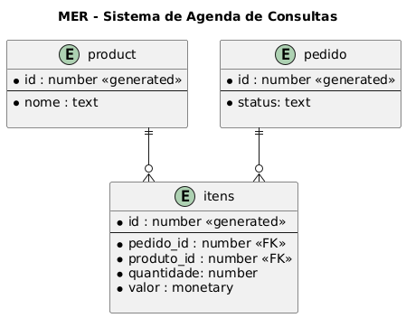

# Study APIr
API Java para estudo de Spring boot

## Client DataBase

## MER

## Docker

120.0.0.1 = localhost
```
docker pull ubuntu
docker images
docker pull debian
docker run ubuntu
docker run -it ubuntu
docker ps -a
docker ps
docker rm f4d759ee0b78
```

* Repositório Docker Hub

```
hub.docker.com
```
## Instalação

- Limpar e criar a pasta _/target_
```
mvn clean package
```

*Configuração do Swagger

    - https://springdoc.org/properties

- application.properties

```
springdoc.swagger-ui.path=/
server.port=9000
```

## Navegação

### Executar a API
-   Executando o __Maven__

```   
mvn spring-boot:run
```

### Documentação da API (Swagger)
- http://localhost:8080/swagger-ui.html

## Referências
-   https://springdoc.org/
- 